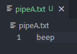

# cs361-Microservice-A
Microservice A implemented for CS361 assign8

To use this microservice, simply run Notification.py and enter the amount of time from now you want to be notified in into pipeA.txt. This time must be an integer, and MUST be in minutes. For 15 minutes, write in '15'; for 1 hour, write in '60'.

The Notification.py program will take in this number, erase the text file, and sleep for that amount of time. When the full time has elapsed, it will then write 'beep' into pipeA.txt. This will be the main program's (yours) cue to receive this beep and implement whatever notification it likes. 

This notification will only happen once for each integer input, and will wait for another integer input to start this process again.

If you have inputted an integer into pipeA.txt and would like to cancel it, simply write in 'cancel' to pipeA.txt and the current notification being timed will be voided and no 'beep' will be written.

It is advised for the main program to clear the pipeA.txt file after receiving the 'beep' as Notification.py will NOT clear pipeA.txt after writing in 'beep'.

UML Diagram:

